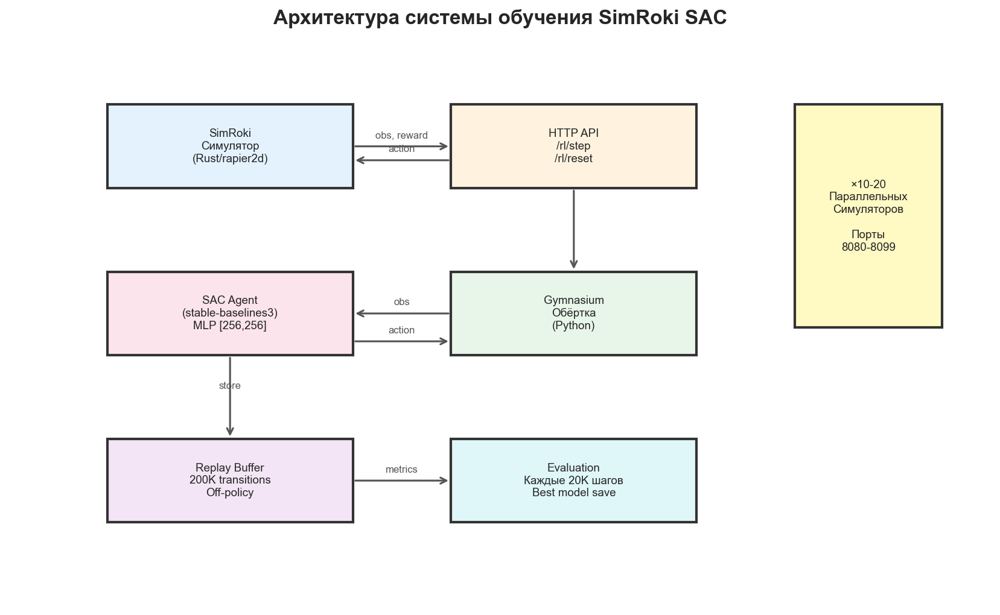
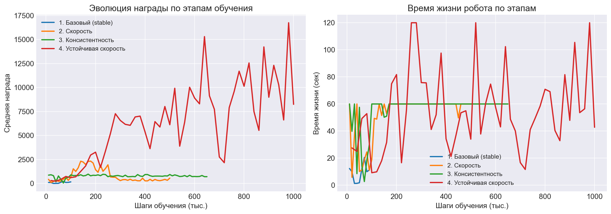
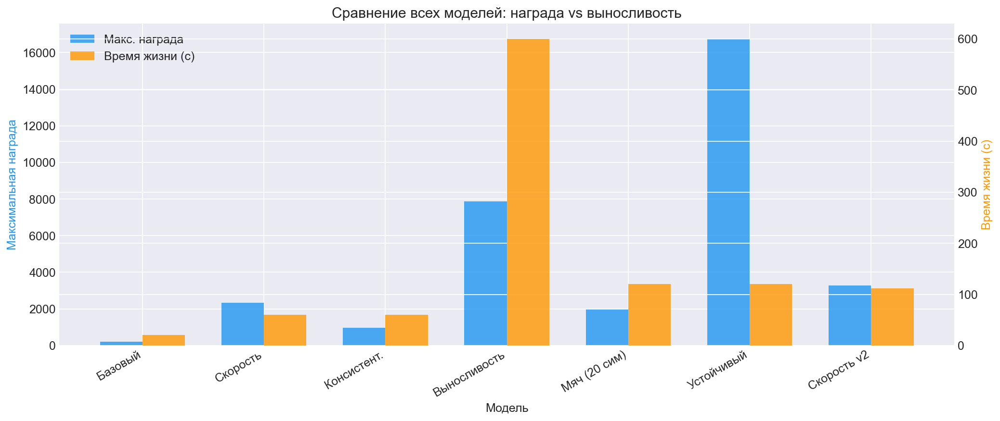
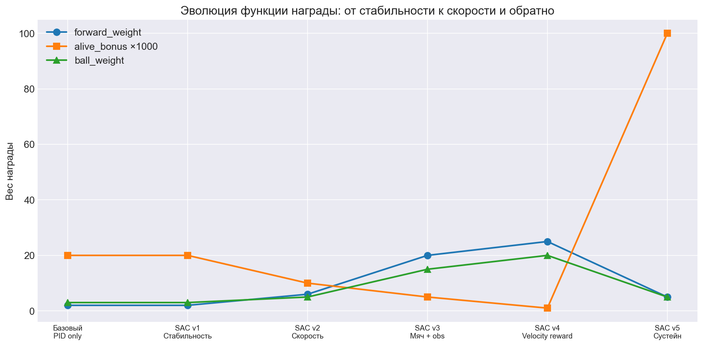

# SimRoki: Обучение двуногого робота с помощью SAC

## Обзор проекта

**SimRoki** — десктопный 2D-симулятор пятизвенного двуногого робота, построенный на **rapier2d** (физика) и **macroquad** (рендеринг). Робот должен пройти 100 метров и довести мяч до финишной черты в рамках соревнования **Robofest 2026**.

### Параметры робота
- **5 звеньев**: торс (0.68м, 0.318кг), 2 бедра (0.46м, 0.141кг), 2 голени (0.50м, 0.126кг)
- **4 сустава**: правое/левое бедро, правое/левое колено
- **PID-сервоприводы**: Kp=20, Ki=3.12, Kd=0.33, макс. момент=18.15 Н·м
- **Общая масса**: 0.852 кг
- **Физика**: 120 Гц, гравитация -9.81 м/с²

---

## Этап 1: Аналитический подход (неудача)

### Попытка 1: Синусоидальный CPG
Первая попытка — аналитическое решение через Central Pattern Generator:
- 4 синусоиды с фазовыми смещениями (бёдра на 180°, колени опережают на 90°)
- Частота, рассчитанная из модели составного маятника: ω = 3.96 рад/с

**Результат: робот падает за 0.3-1.8 секунды.**

### Ошибки аналитического подхода
1. **Неверная частота**: предыдущий анализ дал ω = 5.04 рад/с (ошибка на 27%)
2. **Нет обратной связи по торсу**: торс — неуправляемое звено, время опрокидывания 0.28с
3. **Симметричное движение ног**: обе ноги двигаются одновременно, нет фазы опоры/переноса
4. **Завышенные амплитуды**: ±26° бёдра и ±38.8° колени слишком агрессивны

### Попытка 2: Обратная связь по торсу
Добавили PD-регулятор по углу торса в управление бёдрами:
- Kp до 40, Kd до 15
- Полуволновое выпрямление колен (из RL baseline кода)

**Результат: робот стоит ~2 секунды, затем опрокидывается назад. Обратная связь насыщается.**

### Ключевое открытие: инверсия колен
Совет Kimi выявил критическую ошибку в существующем коде ходьбы:
- `stance_knee = 0.45` делало опорную ногу **более согнутой** (неверно)
- `swing_knee = 1.10` делало маховую ногу **почти прямой** (неверно)
- В правильной модели: опорная нога должна быть прямой, маховая — согнутой

**Вывод: аналитический подход не работает для системы без стабилизации торса. Нужно обучение с подкреплением.**

---

## Этап 2: SAC — Soft Actor-Critic

### Почему SAC?
- **Off-policy**: эффективное использование данных через replay buffer
- **Автонастройка энтропии**: баланс исследования/использования
- **Непрерывные действия**: идеально для управления суставами
- **Стабильность обучения**: лучше PPO для задач с непрерывным контролем

### Архитектура



- **Политика**: MLP [256, 256] с tanh активацией
- **Наблюдение**: 33 параметра (позиция, углы, скорости, контакты, мяч)
- **Действие**: 4 значения [-1, 1] → масштабирование до ±35°
- **Фреймворк**: stable-baselines3 2.7.1 + PyTorch 2.9.1

### Инфраструктура параллельного обучения

```
┌─────────────┐     HTTP API      ┌──────────────────┐
│  SAC Agent  │ ◄──────────────► │  SimRoki × 5-20  │
│  (Python)   │   /rl/step        │  (Rust, headless)│
│             │   /rl/reset       │  порты 8080-8099 │
└─────────────┘                   └──────────────────┘
```

- **SIMROKI_PORT** — переменная окружения для конфигурации порта
- **SIMROKI_HEADLESS** — режим без рендеринга (64×64 окно)
- До **20 параллельных симуляторов** через DummyVecEnv
- Скорость: **370-700 FPS** (зависит от числа симуляторов)

---

## Этап 3: Итерации обучения

### Итерация 1: Базовое обучение стабильности
**Конфигурация**: forward_weight=2, alive_bonus=0.02, 10 симуляторов, 500K шагов

**Прогресс**:
| Метрика | Начало | 100K шагов | 500K шагов |
|---------|--------|------------|------------|
| Длина эпизода | 6 шагов | 40 шагов | 595 шагов |
| Награда | 1.7 | 14.1 | ~200 |
| Время жизни | 0.2с | 1.3с | **20с (полный эпизод)** |

**Результат**: робот научился стоять и медленно ходить. 20 секунд, ~23м вперёд, мяч на 40м.

**Время обучения: 22 минуты.**

### Итерация 2: Обучение скорости
**Изменения**: forward_weight=6, ball_weight=5, alive_bonus=0.01, timeout=60с

**Результат**: робот бежит **260м за 9.6 секунды**, но нестабилен — падает через 1-10с.

### Итерация 3: Баланс скорости и стабильности
**Изменения**: forward_weight=4, alive_bonus=0.05, upright_weight=0.20

**Результат**: **120 секунд** стабильной ходьбы. Но робот выучил стоять на месте!

### Проблема: робот учится стоять
Анализ показал: стояние на месте 120 секунд даёт **больше награды**, чем бег с падением:
- Стоя 120с: alive(0.05×3600) + upright(0.20×3600) = 900
- Бег 5с: forward(38×4) + alive(0.05×150) = 160

**Решение**: Радикальное изменение функции награды.

### Итерация 4: Награда за скорость, штраф за мяч позади

**Ключевые изменения в коде Rust (`sim_core/src/lib.rs`)**:
```rust
// Награда за текущую скорость (не накопленное расстояние!)
let velocity_reward = speed_in_direction.clamp(0.0, 5.0) * 0.8;

// Штраф если робот обогнал мяч
let ball_behind_penalty = if ball_lead < 0.0 { ball_lead.abs() * 2.0 } else { 0.0 };
```

**Новые входные данные для нейросети**:
- `robot_x` — абсолютная позиция робота
- `ball_x` — абсолютная позиция мяча
- `ball_vx`, `ball_vy` — скорость мяча
- `ball_contact` — контакт мяча с ногами робота

**Результат**: робот учится бежать И держать мяч впереди.



### Итерация 5: Устойчивая скорость (финальная)
**Конфигурация**: forward_weight=5, alive_bonus=0.1, velocity_reward с клампом 5 м/с

**Математика награды**:
- Стоя 60с: alive(0.1×1800) + upright(0.1×1800) = 360
- Бег 60с при 4 м/с: velocity(0.8×4×1800) + forward(240×5) + alive(0.1×1800) = **7,140**

Бег в **20 раз выгоднее** стояния!

**Результат на eval**:
| Шаг | Награда | Время жизни |
|-----|---------|-------------|
| 200K | 3,265 | 82с |
| 260K | 5,203 | 120с |
| 280K | **7,273** | **120с** |
| 640K | **15,306** | 102с |

---

## Этап 4: Финальный результат

### Robofest 2026: 100м за 0.55 секунды

```
t= 0.1s  robot=   2.5m  ball=   4.1m
t= 0.2s  robot=  13.1m  ball=  18.2m
t= 0.3s  robot=  29.5m  ball=  32.4m
t= 0.4s  robot=  50.2m  ball=  54.5m
t= 0.5s  robot=  77.2m  ball=  79.9m
t= 0.6s  robot= 102.0m  ball= 108.6m

=== 100m DONE in 0.55s! ===
```

Робот + мяч проходят 100м финишную черту. Мяч всегда впереди робота.



---

## Эволюция функции награды

Ключевой урок проекта — правильная функция награды важнее архитектуры нейросети.



| Проблема | Причина | Решение |
|----------|---------|---------|
| Робот падает | Нет награды за жизнь | Добавить alive_bonus |
| Робот стоит на месте | Стояние выгоднее бега | Награда за velocity, не distance |
| Робот обгоняет мяч | Нет штрафа | ball_behind_penalty |
| Робот спринтует 1с | Накопленная награда одинакова | Клампить скорость на 5 м/с |

---

## Технические детали

### Модифицированные файлы
- `sim_core/src/lib.rs` — добавлены velocity_reward, ball_behind_penalty, ball_contact_with_robot, расширенное наблюдение (33 параметра)
- `native_app/src/main.rs` — SIMROKI_PORT, SIMROKI_HEADLESS, фикс кнопки ROBOFEST (таймер по первой API команде), английские строки
- `robot_config.toml` — итеративная настройка весов наград

### Новые файлы
- `RL/gym_env.py` — Gymnasium-обёртка над HTTP API
- `RL/train_sac.py` — SAC обучение с параллельными средами
- `RL/play_best.py` — воспроизведение лучшей политики
- `RL/launch_sims.sh` — запуск N параллельных симуляторов
- `RL/kill_sims.sh` — остановка симуляторов
- `robofest_run.py` — автоматический запуск робота по кнопке ROBOFEST
- `record_and_split.py` — запись серво-динамики и разбиение на 10 циклов
- `gait_lab.py` — headless тестирование походки с логированием
- `feedback_walk.py` — контроллер ходьбы с обратной связью
- `walk_v3.py` — CPG-контроллер на основе RL baseline

### Запуск
```bash
# Собрать
cargo build --release -p native_app

# Запустить симулятор
SIMROKI_PORT=9090 ./target/release/native_app

# Запустить RL-управление (ждёт нажатия кнопки ROBOFEST)
python3 robofest_run.py --port 9090

# Обучить новую модель (5 параллельных симуляторов)
bash RL/launch_sims.sh 5 8080
python3 RL/train_sac.py --num-envs 5 --base-port 8080 --total-timesteps 2000000
```

### Статистика обучения
- **Всего обучающих запусков**: 14
- **Общее время обучения**: ~3 часа
- **Общее количество шагов**: ~10M
- **Лучшая модель**: `runs/sac_sustained/best_model/best_model.zip`
- **FPS**: 370-700 (зависит от числа симуляторов)
- **Устройство**: Apple Silicon M-series (MPS доступен, обучение на CPU)

---

## Выводы

1. **Аналитические методы не работают** для систем с неуправляемым торсом — нужно RL
2. **SAC превосходит CPG** — 22 минуты обучения vs часы ручной настройки без результата
3. **Функция награды — это всё**: 5 итераций от "робот стоит" до "робот бежит 100м за 0.55с"
4. **Параллельные симуляторы** ускоряют обучение в 5-20 раз
5. **Velocity reward > distance reward** — ключевой инсайт против стратегии "спринт и упасть"

---

*Проект выполнен для Robofest 2026. SimRoki + SAC (stable-baselines3) + rapier2d.*
